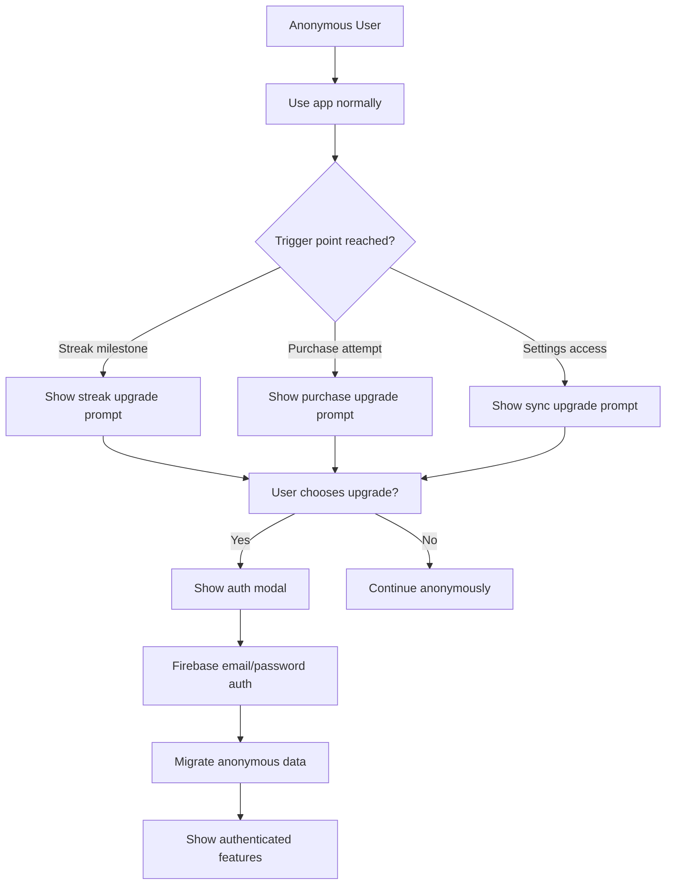

# Optional Firebase Authentication Flow Design

## Overview
This document outlines the design for optional Firebase authentication in the Hater AI app. The goal is to provide account benefits while maintaining zero-friction entry for new users.

## Core Principles
- **Anonymous First**: Users can use the app immediately without accounts
- **Progressive Upgrades**: Gentle prompts for account creation at strategic moments
- **Clear Benefits**: Users understand what they gain from accounts
- **Seamless Migration**: Smooth transition from anonymous to authenticated users

---

## User Journey Flow

### 1. New User Experience
```mermaid
graph TD
    A[User opens app] --> B{First time?}
    B -->|Yes| C[Anonymous auth: signInAnonymously()]
    B -->|No| D[Check existing auth state]
    C --> E[Generate anonymous user ID]
    D --> F[Restore previous session]
    E --> G[Show main app interface]
    F --> G
```

### 2. Upgrade Journey


---

## Firebase Configuration

### Required Firebase Services
```json
{
  "firebase": {
    "auth": {
      "anonymous": true,
      "email": true
    },
    "firestore": {
      "rules": "authenticated users can read/write their own data"
    }
  }
}
```

### Firestore Data Structure
```
/users/{userId}/
├── profile/
│   ├── displayName: string
│   ├── email: string
│   ├── createdAt: timestamp
│   ├── lastLoginAt: timestamp
│   └── anonymousId: string (for data migration)
├── conversations/
│   └── {conversationId}/
│       ├── messages: array
│       ├── personality: string
│       └── timestamp: timestamp
├── streaks/
│   ├── currentStreak: number
│   ├── longestStreak: number
│   ├── lastActivity: timestamp
│   └── streakHistory: array
├── settings/
│   ├── intensity: number
│   ├── personality: string
│   ├── allowCursing: boolean
│   └── theme: string
└── purchases/
    ├── unlockedFeatures: array
    ├── unlockedPersonalities: array
    └── transactionHistory: array
```

---

## Component Architecture

### Core Auth Components

#### 1. AuthProvider (Context)
```typescript
interface AuthContextType {
  user: User | null;
  isAnonymous: boolean;
  loading: boolean;
  signInAnonymously: () => Promise<void>;
  signUpWithEmail: (email: string, password: string) => Promise<void>;
  signInWithEmail: (email: string, password: string) => Promise<void>;
  linkAnonymousAccount: (email: string, password: string) => Promise<void>;
  signOut: () => Promise<void>;
  migrateAnonymousData: () => Promise<void>;
}
```

#### 2. AuthModal (Main auth interface)
```typescript
interface AuthModalProps {
  isVisible: boolean;
  onClose: () => void;
  trigger: 'streak' | 'purchase' | 'settings' | 'manual';
  onSuccess?: () => void;
}
```

#### 3. UpgradePrompt (Contextual prompts)
```typescript
interface UpgradePromptProps {
  type: 'streak' | 'purchase' | 'sync' | 'backup';
  onUpgrade: () => void;
  onDismiss: () => void;
  data?: any; // Additional context data
}
```

---

## Upgrade Trigger Points

### 1. Streak Milestone Prompt
**Trigger**: User reaches 7-day streak
```typescript
// In StreakService
if (currentStreak === 7 && !user) {
  showUpgradePrompt({
    type: 'streak',
    title: "Don't Lose Your Streak! 🔥",
    message: "Create an account to sync your streak across all your devices",
    benefits: ["Cross-device sync", "Never lose progress", "Advanced stats"]
  });
}
```

### 2. Purchase Attempt Prompt
**Trigger**: Anonymous user tries to purchase
```typescript
// In PremiumService
if (!user && attemptingPurchase) {
  showUpgradePrompt({
    type: 'purchase',
    title: "Save Your Purchase 💰",
    message: "Create an account to manage your purchases and unlock premium features everywhere",
    benefits: ["Purchase history", "Restore purchases", "Premium support"]
  });
}
```

### 3. Settings Access Prompt
**Trigger**: User accesses settings screen
```typescript
// In SettingsScreen
if (!user) {
  showUpgradePrompt({
    type: 'sync',
    title: "Sync Your Settings ☁️",
    message: "Save your preferences and access them on any device",
    benefits: ["Settings sync", "Personalized experience", "Data backup"]
  });
}
```

### 4. Conversation History Prompt
**Trigger**: User has 10+ conversations
```typescript
// In ChatScreen
if (conversationCount >= 10 && !user) {
  showUpgradePrompt({
    type: 'backup',
    title: "Backup Your Conversations 💬",
    message: "Never lose your favorite roasts - save them to the cloud",
    benefits: ["Conversation history", "Search past chats", "Export data"]
  });
}
```

---

## UI/UX Design

### Auth Modal Design
```
┌─────────────────────────────────────┐
│           Create Account            │
│                                     │
│  [📧] Email                         │
│  ┌─────────────────────────────┐    │
│  │ example@email.com           │    │
│  └─────────────────────────────┘    │
│                                     │
│  [🔒] Password                      │
│  ┌─────────────────────────────┐    │
│  │ ••••••••••••••              │    │
│  └─────────────────────────────┘    │
│                                     │
│  [✨] Create Account & Sync Data     │
│                                     │
│  ─────────────────────────────────  │
│                                     │
│  Benefits you'll get:              │
│  ✅ Cross-device sync              │
│  ✅ Never lose progress            │
│  ✅ Advanced personalization       │
│                                     │
│  [Maybe Later]                     │
└─────────────────────────────────────┘
```

### Upgrade Prompt Design
```
┌─────────────────────────────────────┐
│        🔥 Streak Alert!             │
│                                     │
│  You're on a 7-day streak!         │
│  Don't lose it when you switch     │
│  devices or get a new phone.       │
│                                     │
│  [Create Account]  [Maybe Later]   │
│                                     │
│  💡 Sync across all devices        │
│  💡 Never lose your progress       │
│  💡 Advanced stats & insights      │
└─────────────────────────────────────┘
```

---

## Data Migration Strategy

### Anonymous to Authenticated Migration
```typescript
async function migrateAnonymousData(userId: string): Promise<void> {
  // 1. Get anonymous user ID from local storage
  const anonymousId = await AsyncStorage.getItem('anonymousUserId');

  // 2. Export all local data
  const localData = {
    conversations: await StorageService.getConversations(),
    streaks: await StreakService.getStreakData(),
    settings: await StorageService.getSettings(),
    purchases: await PremiumService.getPurchaseData()
  };

  // 3. Upload to Firestore under authenticated user ID
  await FirestoreService.migrateUserData(userId, anonymousId, localData);

  // 4. Update local storage to reference cloud data
  await AsyncStorage.setItem('dataSource', 'cloud');
  await AsyncStorage.setItem('cloudUserId', userId);

  // 5. Clear old anonymous data (optional - keep for backup)
  // await StorageService.clearAnonymousData();
}
```

### Conflict Resolution
- **Last Write Wins**: Cloud data takes precedence for settings
- **Merge Conversations**: Combine local and cloud conversation history
- **Preserve Streaks**: Keep the higher streak value
- **Union Purchases**: Combine all unlocked features/personalities

---

## Integration Points

### 1. Streak Service Integration
```typescript
// StreakService updates both local and cloud
class StreakService {
  async updateStreak(): Promise<void> {
    const newStreak = calculateStreak();

    // Update local storage
    await AsyncStorage.setItem('currentStreak', newStreak);

    // Update cloud if authenticated
    if (auth.currentUser) {
      await FirestoreService.updateStreak(auth.currentUser.uid, newStreak);
    }
  }
}
```

### 2. Premium Service Integration
```typescript
// PremiumService handles purchase sync
class PremiumService {
  async unlockFeature(featureId: string): Promise<void> {
    // Update local storage
    await StorageService.setUnlockedFeatures([...unlockedFeatures, featureId]);

    // Sync to cloud if authenticated
    if (auth.currentUser) {
      await FirestoreService.syncPurchases(auth.currentUser.uid, purchaseData);
    }
  }
}
```

---

## Error Handling & Edge Cases

### Network Issues
- **Offline Mode**: Allow anonymous usage, queue cloud sync for when online
- **Sync Conflicts**: Show user options for resolving data conflicts
- **Partial Sync**: Handle cases where some data syncs but not all

### Account Recovery
- **Email Verification**: Optional for account creation
- **Password Reset**: Standard Firebase auth flow
- **Account Linking**: Allow linking anonymous accounts to existing users

### Privacy & Security
- **Data Encryption**: Use Firebase security rules
- **Anonymous Data**: Clear anonymous data after successful migration
- **GDPR Compliance**: Provide data export/deletion options

---

## Implementation Phases

### Phase 1: Core Auth Setup
1. Firebase configuration
2. Anonymous authentication
3. Basic auth UI components
4. Local data structure updates

### Phase 2: Upgrade Prompts
1. Streak milestone prompts
2. Purchase prompts
3. Settings access prompts
4. Conversation backup prompts

### Phase 3: Data Sync
1. Firestore data structure
2. Migration logic
3. Conflict resolution
4. Offline sync queue

### Phase 4: Advanced Features
1. Cross-device sync
2. Advanced personalization
3. Analytics integration
4. Performance optimization

---

## Success Metrics

### User Engagement
- **Conversion Rate**: % of anonymous users who create accounts
- **Retention**: Compare retention between anonymous vs authenticated users
- **Feature Usage**: Increased usage of premium features after account creation

### Technical Metrics
- **Sync Success Rate**: % of data migrations that complete successfully
- **Auth Error Rate**: Failed authentication attempts
- **Offline Usage**: % of sessions that work offline

---

## Testing Strategy

### Unit Tests
- Auth context state management
- Data migration logic
- Offline sync functionality

### Integration Tests
- Firebase Auth flows
- Firestore data operations
- Cross-device sync

### User Testing
- Anonymous user journey
- Account creation flow
- Upgrade prompt effectiveness
- Data migration experience

---

## Conclusion

This optional authentication design provides:
- **Zero-friction entry** for new users
- **Clear upgrade paths** at strategic moments
- **Robust data sync** for authenticated users
- **Scalable architecture** for future features

The key is balancing user freedom with the benefits of accounts, creating natural upgrade moments that feel helpful rather than pushy.
